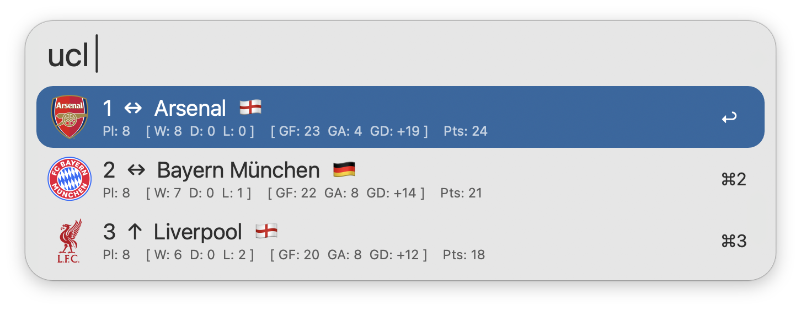

#  UEFA Champions League Stats

View the latest UEFA Champions League standings & stats in Alfred

## Setup

This workflow requires [jq](https://jqlang.github.io/jq/) to function, which comes preinstalled on macOS 15 Sequoia and later.

## Usage

View the latest [UEFA Champions League](https://www.uefa.com/uefachampionsleague/) standings via the `ucl` keyword. Type to filter by Team, Rank, Country, or Qualified.

* <kbd>↩</kbd> View Team Stats in Alfred.
* <kbd>⌘</kbd><kbd>↩</kbd> Open Team Stats in Browser.

Additional Team Stats can be viewed directly within Alfred. This includes Goals, Attempts, Distribution, Attacking, Defending, Goalkeeping, and Disciplinary Stats.

* <kbd>⌘</kbd><kbd>↩</kbd> Open in Browser.
* <kbd>⌥</kbd><kbd>↩</kbd> Refresh Team Stats.

Append `::` to the configured [Keyword](https://www.alfredapp.com/help/workflows/inputs/keyword) to access other actions, such as manually reloading the standings cache.

Configure the [Hotkey](https://www.alfredapp.com/help/workflows/triggers/hotkey/) as a shortcut for viewing standings.